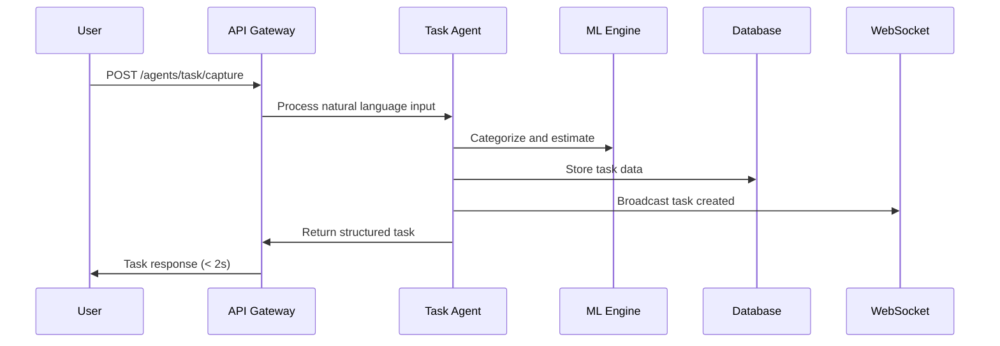
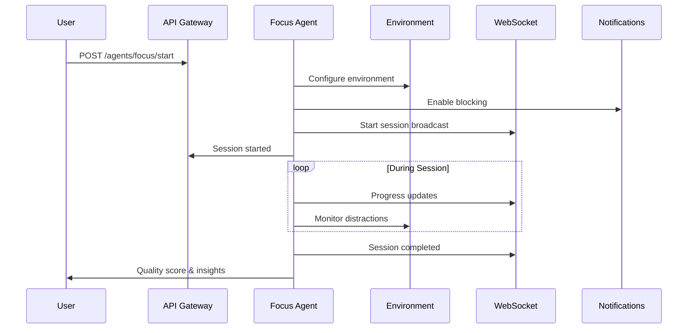
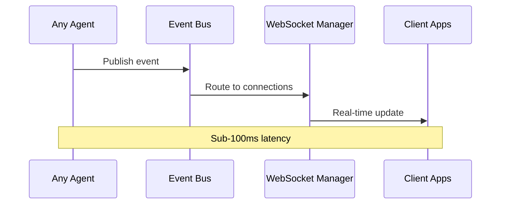

# 🏗️ System Architecture Overview

The Proxy Agent Platform is built on a modern, scalable architecture designed to handle millions of users while maintaining sub-second response times for critical features like task capture and focus session management.

## 🎯 Architectural Principles

### 1. Agent-Centric Design
Every major feature is implemented as a specialized AI agent:
- **Task Proxy**: Handles task capture, categorization, and scheduling
- **Focus Proxy**: Manages focus sessions and distraction blocking
- **Energy Proxy**: Tracks and predicts user energy levels
- **Progress Proxy**: Analyzes progress and provides motivation

### 2. Event-Driven Architecture
Components communicate through asynchronous events for:
- **Loose Coupling**: Services can evolve independently
- **Scalability**: Easy to scale individual components
- **Reliability**: Built-in retry and error handling
- **Real-time Updates**: Instant synchronization across all clients

### 3. API-First Development
All functionality is exposed through well-designed APIs:
- **REST APIs**: For traditional request/response patterns
- **WebSocket APIs**: For real-time bidirectional communication
- **GraphQL**: For complex data queries (future)
- **SDK Support**: Official SDKs for major platforms

### 4. Microservices with Monolith Benefits
Structured as a modular monolith that can be split into microservices:
- **Single Deployment**: Simplified operations and development
- **Shared Database**: ACID transactions across features
- **Module Boundaries**: Clear separation of concerns
- **Future-Proof**: Easy to extract services when needed

## 📊 High-Level Architecture

```
┌─────────────────────────────────────────────────────────────────────────────┐
│                                Client Layer                                 │
├─────────────────┬─────────────────┬─────────────────┬─────────────────────────┤
│   Web App       │   Mobile Apps   │   Desktop CLI   │   External APIs         │
│   (React/Next)  │   (iOS/Android) │   (Python)      │   (REST/GraphQL)        │
└─────────────────┴─────────────────┴─────────────────┴─────────────────────────┘
                                      │
┌─────────────────────────────────────────────────────────────────────────────┐
│                            API Gateway Layer                               │
├─────────────────────────────────────────────────────────────────────────────┤
│  • FastAPI Router                    • Rate Limiting                       │
│  • Authentication/Authorization      • Request Validation                  │
│  • WebSocket Manager                 • Response Formatting                 │
│  • CORS & Security Headers          • Error Handling                      │
└─────────────────────────────────────────────────────────────────────────────┘
                                      │
┌─────────────────────────────────────────────────────────────────────────────┐
│                              Agent Layer                                   │
├────────────────┬────────────────┬────────────────┬─────────────────────────┤
│   Task Proxy   │  Focus Proxy   │  Energy Proxy  │   Progress Proxy        │
│                │                │                │                         │
│ • 2s Capture   │ • Sessions     │ • Tracking     │ • Analytics             │
│ • Smart Schedule│ • Distraction  │ • Prediction   │ • Gamification          │
│ • Categorization│   Blocking     │ • Optimization │ • Achievements          │
│ • Delegation   │ • Flow State   │ • Recovery     │ • Motivation            │
└────────────────┴────────────────┴────────────────┴─────────────────────────┘
                                      │
┌─────────────────────────────────────────────────────────────────────────────┐
│                            Core Services Layer                             │
├─────────────────┬─────────────────┬─────────────────┬─────────────────────────┤
│ Agent Framework │ Learning Engine │ Workflow System │ Notification Service   │
│                 │                 │                 │                         │
│ • PydanticAI    │ • ML Models     │ • Orchestration │ • Push Notifications    │
│ • Communication │ • Pattern       │ • State Machine │ • Email & SMS           │
│ • Registry      │   Analysis      │ • Event Bus     │ • Real-time Updates     │
│ • Monitoring    │ • Predictions   │ • Error Handling│ • Smart Scheduling      │
└─────────────────┴─────────────────┴─────────────────┴─────────────────────────┘
                                      │
┌─────────────────────────────────────────────────────────────────────────────┐
│                           Integration Layer                                │
├─────────────────┬─────────────────┬─────────────────┬─────────────────────────┤
│ Mobile Services │ Calendar APIs   │ AI Providers    │ External Tools          │
│                 │                 │                 │                         │
│ • iOS Shortcuts │ • Google Cal    │ • OpenAI        │ • Slack Integration     │
│ • Android       │ • Outlook       │ • Anthropic     │ • Notion API            │
│   Intents       │ • Apple Cal     │ • Google AI     │ • Todoist Sync          │
│ • Voice Process │ • CalDAV        │ • Local Models  │ • Zapier Webhooks       │
└─────────────────┴─────────────────┴─────────────────┴─────────────────────────┘
                                      │
┌─────────────────────────────────────────────────────────────────────────────┐
│                              Data Layer                                    │
├─────────────────┬─────────────────┬─────────────────┬─────────────────────────┤
│   PostgreSQL    │     Redis       │   File Storage  │   External APIs         │
│                 │                 │                 │                         │
│ • User Data     │ • Session Cache │ • ML Models     │ • Weather Data          │
│ • Task Storage  │ • Real-time     │ • User Files    │ • Calendar Events       │
│ • Analytics     │   Updates       │ • Backups       │ • Location Services     │
│ • Audit Logs    │ • Job Queue     │ • Static Assets │ • Time Zone Data        │
└─────────────────┴─────────────────┴─────────────────┴─────────────────────────┘
```

## 🧩 Component Details

### API Gateway Layer

**FastAPI Application**
- High-performance async web framework
- Automatic OpenAPI documentation
- Built-in request/response validation
- Native WebSocket support

**Authentication & Authorization**
- JWT-based authentication with refresh tokens
- Role-based access control (RBAC)
- API key management for external integrations
- OAuth2 support for third-party services

**Rate Limiting & Security**
- Per-user and per-endpoint rate limiting
- CORS protection with configurable origins
- Request size limits and timeout handling
- SQL injection and XSS protection

### Agent Layer

**Base Agent Framework**
```python
class BaseProxyAgent:
    """
    Foundation for all AI agents with common capabilities:
    - PydanticAI integration for type-safe AI interactions
    - Inter-agent communication protocol
    - Context management and state persistence
    - Performance monitoring and error handling
    """
```

**Task Proxy Agent**
- **2-Second Capture**: Ultra-fast natural language processing
- **Smart Categorization**: AI-powered task classification
- **Intelligent Scheduling**: Energy and calendar-aware scheduling
- **Context Awareness**: Location, time, and user state integration

**Focus Proxy Agent**
- **Session Management**: Pomodoro, deep work, and flow state sessions
- **Distraction Blocking**: Website and notification filtering
- **Quality Tracking**: Focus quality scoring and improvement suggestions
- **Environmental Optimization**: Lighting, sound, and workspace recommendations

**Energy Proxy Agent**
- **Level Tracking**: Continuous energy level monitoring
- **Pattern Recognition**: AI-powered pattern analysis
- **Predictive Modeling**: Machine learning for energy forecasting
- **Recovery Optimization**: Personalized recovery strategies

**Progress Proxy Agent**
- **Achievement Tracking**: Goal progress and milestone detection
- **Gamification Engine**: XP, badges, and streak management
- **Analytics Dashboard**: Productivity insights and trends
- **Motivation System**: Personalized encouragement and challenges

### Core Services Layer

**Learning Engine**
- **Pattern Analysis**: Behavioral pattern recognition using ML
- **Predictive Models**: Energy, focus, and productivity forecasting
- **Recommendation Engine**: Personalized optimization suggestions
- **Adaptive Algorithms**: Self-improving algorithms based on user feedback

**Workflow System**
- **Orchestration Engine**: Complex multi-step workflow execution
- **State Management**: Persistent workflow state across restarts
- **Error Handling**: Automatic retry with exponential backoff
- **Human-in-the-Loop**: Strategic human validation points

**Event Bus**
- **Asynchronous Messaging**: Redis-based pub/sub for real-time updates
- **Event Sourcing**: Complete audit trail of all system events
- **Saga Pattern**: Distributed transaction management
- **Dead Letter Queues**: Failed message handling and recovery

### Data Layer

**PostgreSQL Database**
```sql
-- Optimized for OLTP with analytics capability
-- Partitioned tables for time-series data
-- Materialized views for complex analytics
-- Full-text search for task and note content
```

**Redis Cache & Session Store**
- **Session Management**: User session and authentication state
- **Real-time Data**: WebSocket connection state and live updates
- **Job Queue**: Background task processing with Celery
- **Application Cache**: Frequently accessed data caching

**External Integrations**
- **AI Providers**: OpenAI, Anthropic, Google AI with fallback chains
- **Calendar APIs**: Google Calendar, Outlook, Apple Calendar
- **Mobile Platforms**: iOS Shortcuts, Android Intents, voice assistants
- **Third-party Tools**: Slack, Notion, Todoist, Zapier

## 🔄 Data Flow Patterns

### Task Capture Flow



### Focus Session Flow



### Real-time Update Flow



## 📈 Scalability Design

### Horizontal Scaling Points

**API Layer**
- Stateless FastAPI instances behind load balancer
- Auto-scaling based on CPU and response time metrics
- Health checks and graceful shutdown handling

**Agent Processing**
- Async processing with connection pooling
- Background job queues for time-intensive operations
- Circuit breakers for external AI service calls

**Database Layer**
- Read replicas for analytics queries
- Connection pooling with PgBouncer
- Partitioned tables for time-series data

**Cache Layer**
- Redis Cluster for high availability
- Cache warming strategies for critical data
- Eviction policies optimized for access patterns

### Performance Targets

| Component | Target | Measurement |
|-----------|--------|-------------|
| Task Capture | < 2 seconds | End-to-end response time |
| Focus Session Start | < 100ms | API response time |
| Real-time Updates | < 50ms | WebSocket message latency |
| Dashboard Load | < 1 second | Time to interactive |
| Mobile Sync | < 500ms | Cross-device synchronization |

### Monitoring & Observability

**Application Metrics**
- Response times and error rates per endpoint
- Agent processing times and success rates
- Database query performance and connection health
- Cache hit rates and memory usage

**Business Metrics**
- Task capture success rates and timing
- Focus session completion rates
- User engagement and retention metrics
- Feature adoption and usage patterns

**Infrastructure Metrics**
- Server CPU, memory, and disk usage
- Network latency and throughput
- Database connection pools and query performance
- Cache performance and eviction rates

## 🔒 Security Architecture

### Authentication & Authorization

**Multi-Factor Authentication**
- JWT tokens with short expiration times
- Refresh token rotation for security
- Device fingerprinting for anomaly detection
- Optional TOTP for high-security accounts

**API Security**
- Rate limiting per user and endpoint
- Input validation and sanitization
- SQL injection and XSS protection
- CORS with strict origin policies

### Data Protection

**Encryption**
- TLS 1.3 for all external communication
- Database encryption at rest
- Encrypted backup storage
- Key rotation policies

**Privacy**
- GDPR compliance with data export/deletion
- Data anonymization for analytics
- Audit logging for all data access
- User consent management

### Infrastructure Security

**Network Security**
- VPC with private subnets for databases
- WAF protection for public endpoints
- DDoS protection and traffic filtering
- Security group restrictions

**Container Security**
- Minimal base images with security scanning
- Non-root container execution
- Secret management with rotation
- Runtime security monitoring

## 🚀 Deployment Architecture

### Environment Strategy

**Development**
- Local development with Docker Compose
- SQLite for rapid iteration
- Hot reload for code changes
- Mock external services

**Staging**
- Production-like environment
- Full PostgreSQL and Redis setup
- Integration testing with real APIs
- Performance testing with synthetic load

**Production**
- Multi-AZ deployment for high availability
- Database clustering with failover
- CDN for static asset delivery
- Automated backup and recovery

### CI/CD Pipeline

**Code Quality Gates**
- Automated testing with 95%+ coverage
- Static analysis and security scanning
- Performance regression testing
- Code review requirements

**Deployment Strategy**
- Blue-green deployments for zero downtime
- Canary releases for risk mitigation
- Database migration automation
- Rollback capabilities

### Disaster Recovery

**Backup Strategy**
- Continuous database replication
- Daily encrypted backups to cloud storage
- Point-in-time recovery capability
- Cross-region backup replication

**Recovery Procedures**
- RTO: 15 minutes for critical services
- RPO: 1 minute for data loss
- Automated failover for database
- Manual failover for application tier

## 🔮 Future Architecture Evolution

### Planned Enhancements

**Microservices Migration**
- Gradual extraction of services
- API gateway evolution
- Service mesh implementation
- Distributed tracing

**AI/ML Infrastructure**
- Model serving infrastructure
- A/B testing for ML models
- Feature store implementation
- Real-time model inference

**Global Scaling**
- Multi-region deployment
- Edge computing for mobile
- Data sovereignty compliance
- Latency optimization

### Technology Roadmap

**Short Term (3-6 months)**
- GraphQL API implementation
- Advanced caching strategies
- Mobile app optimization
- Real-time collaboration features

**Medium Term (6-12 months)**
- Machine learning pipeline automation
- Advanced analytics platform
- Third-party integration marketplace
- Enterprise security features

**Long Term (12+ months)**
- Federated learning implementation
- Edge AI for offline operation
- Blockchain for data integrity
- Quantum-resistant encryption

---

This architecture is designed to scale from thousands to millions of users while maintaining the responsiveness and intelligence that makes the Proxy Agent Platform uniquely valuable for productivity enhancement.

The modular design allows for incremental improvements and feature additions without disrupting existing functionality, ensuring the platform can evolve with user needs and technological advances.
