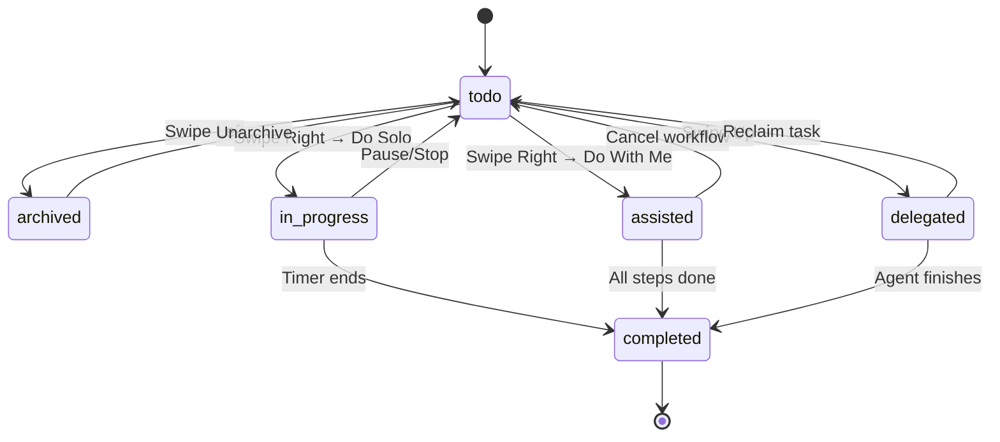

# Dogfooding Interaction Model - Mobile Task Management

## Overview

This document defines the mobile-first interaction model for dogfooding the Proxy Agent Platform in daily use.

## Card Swipe Gestures

### Visual Layout
```
┌─────────────────────────────┐
│   ← Archive                 │
│                             │
│   ↑ Delegate                │
│                             │
│   📋 Task Card              │
│   "Write landing page copy" │
│   🔋 Energy: Medium          │
│   ⏱️  Est: 30 min            │
│   ⭐ Priority: High          │
│                             │
│   Do →                      │
│                             │
└─────────────────────────────┘
```

### Swipe Actions

| Gesture | Action | Result |
|---------|--------|--------|
| **← Swipe Left** | Archive/Dismiss | Task hidden from active queue, status → `archived`, logged in `task_actions` |
| **↑ Swipe Up** | Delegate to AI | Task status → `delegated`, assigned to best agent, appears in agent queue |
| **→ Swipe Right** | DO (Execute) | Opens detailed DO Screen with execution options |

---

## DO Screen (Expanded Card View)

When user swipes right, card **expands fullscreen** with detailed execution options:

### Visual Layout
```
┌─────────────────────────────────────┐
│  ← Back to Queue                    │
│                                     │
│  📋 Write landing page copy         │
│  ━━━━━━━━━━━━━━━━━━━━━━━━━━━━━━  │
│                                     │
│  📝 Description:                    │
│  Create compelling headline and     │
│  hero section copy for landing page │
│                                     │
│  🔋 Energy: Medium (2/3)            │
│  ⏱️  Estimated: 30 minutes          │
│  ⭐ Priority: High                  │
│  🏆 XP Reward: 15 XP                │
│                                     │
│  ━━━━━━━━━━━━━━━━━━━━━━━━━━━━━━  │
│                                     │
│  🎯 EXECUTION OPTIONS:              │
│                                     │
│  ┌─────────────────────────────┐   │
│  │  🤝 Do With Me              │   │
│  │  (AI assists you step-by-step) │
│  └─────────────────────────────┘   │
│                                     │
│  ┌─────────────────────────────┐   │
│  │  💪 Do Solo                 │   │
│  │  (Start timer, I'll handle it) │
│  └─────────────────────────────┘   │
│                                     │
│  ━━━━━━━━━━━━━━━━━━━━━━━━━━━━━━  │
│                                     │
│  📝 Quick Notes (optional):         │
│  ┌─────────────────────────────┐   │
│  │                             │   │
│  └─────────────────────────────┘   │
│                                     │
│  ⏰ Start Pomodoro (25 min)         │
│                                     │
└─────────────────────────────────────┘
```

### DO Screen Actions

#### 1. **Do With Me** (Collaborative Mode)
- Opens AI-assisted workflow execution
- Agent provides:
  - Step-by-step guidance
  - Real-time suggestions
  - Progress tracking
  - Contextual help

**API Call:**
```python
POST /api/v1/tasks/{task_id}/execute
{
  "mode": "assisted",
  "workflow_id": "auto_detect"  # AI picks best workflow
}
```

**Response:**
```json
{
  "execution_id": "exec_123",
  "workflow_id": "content_creation_tdd",
  "steps": [
    {
      "step_id": 1,
      "title": "Brainstorm 5 headline options",
      "estimated_minutes": 5,
      "status": "pending"
    },
    {
      "step_id": 2,
      "title": "Write hero section (2-3 sentences)",
      "estimated_minutes": 10,
      "status": "pending"
    }
  ],
  "ai_context": "I'll guide you through creating landing page copy using proven frameworks."
}
```

#### 2. **Do Solo** (Independent Mode)
- Starts focus timer
- Logs start time
- Opens task in "active" state
- Shows minimal timer UI
- Notifies on completion

**API Call:**
```python
POST /api/v1/tasks/{task_id}/start-solo
{
  "pomodoro_duration": 25  # minutes
}
```

**Response:**
```json
{
  "focus_session_id": "session_456",
  "task_id": "task_789",
  "started_at": "2025-11-01T14:30:00Z",
  "estimated_end": "2025-11-01T15:00:00Z",
  "timer_running": true
}
```

---

## Backend API Endpoints

### Task Actions

#### Archive Task
```http
POST /api/v1/tasks/{task_id}/archive
```

**Request:**
```json
{
  "reason": "not_relevant" | "later" | "delegated_elsewhere"
}
```

**Response:**
```json
{
  "task_id": "task_123",
  "status": "archived",
  "archived_at": "2025-11-01T14:30:00Z",
  "xp_penalty": 0
}
```

---

#### Delegate Task
```http
POST /api/v1/tasks/{task_id}/delegate
```

**Request:**
```json
{
  "auto_assign": true,  // Let system pick best agent
  "agent_id": null      // Or specify agent
}
```

**Response:**
```json
{
  "task_id": "task_123",
  "status": "delegated",
  "assigned_agent": "task_proxy_intelligent",
  "delegation_mode": "autonomous",
  "estimated_completion": "2025-11-01T16:00:00Z"
}
```

---

#### Execute Task (Do With Me)
```http
POST /api/v1/tasks/{task_id}/execute
```

**Request:**
```json
{
  "mode": "assisted",
  "workflow_id": "auto_detect"
}
```

**Response:** (See DO Screen Actions above)

---

#### Start Solo Execution
```http
POST /api/v1/tasks/{task_id}/start-solo
```

**Request:**
```json
{
  "pomodoro_duration": 25,
  "notes": "Optional quick notes before starting"
}
```

**Response:** (See DO Screen Actions above)

---

## Task Card State Machine



---

## Mobile Component Structure

### File Structure
```
frontend/src/app/dogfood/
├── TaskQueue.tsx          # Main swipeable task list
├── TaskCard.tsx           # Individual swipeable card
├── DoScreen.tsx           # Expanded DO view
├── AssistedExecution.tsx  # Do With Me workflow UI
├── SoloExecution.tsx      # Do Solo timer UI
└── hooks/
    ├── useSwipeGestures.ts
    ├── useTaskActions.ts
    └── useFocusTimer.ts
```

### Key Components

#### TaskCard.tsx
```tsx
interface TaskCardProps {
  task: Task;
  onArchive: () => void;
  onDelegate: () => void;
  onExecute: () => void;
}

export function TaskCard({ task, onArchive, onDelegate, onExecute }: TaskCardProps) {
  const { handleSwipe } = useSwipeGestures({
    onSwipeLeft: onArchive,
    onSwipeUp: onDelegate,
    onSwipeRight: onExecute,
  });

  return (
    <motion.div
      drag="x"
      dragConstraints={{ left: -200, right: 200 }}
      onDragEnd={handleSwipe}
      className="task-card"
    >
      <div className="task-content">
        <h3>{task.title}</h3>
        <div className="task-meta">
          <EnergyIndicator level={task.energy_cost} />
          <TimeEstimate minutes={task.estimated_minutes} />
          <PriorityBadge priority={task.priority} />
        </div>
      </div>
    </motion.div>
  );
}
```

#### DoScreen.tsx
```tsx
interface DoScreenProps {
  task: Task;
  onBack: () => void;
  onStartAssisted: () => void;
  onStartSolo: () => void;
}

export function DoScreen({ task, onBack, onStartAssisted, onStartSolo }: DoScreenProps) {
  const [notes, setNotes] = useState("");

  return (
    <motion.div
      initial={{ x: "100%" }}
      animate={{ x: 0 }}
      exit={{ x: "100%" }}
      className="do-screen"
    >
      <Header>
        <BackButton onClick={onBack} />
        <h2>{task.title}</h2>
      </Header>

      <TaskDetails task={task} />

      <ExecutionOptions>
        <Button
          variant="primary"
          icon={<HandshakeIcon />}
          onClick={onStartAssisted}
        >
          Do With Me
          <span className="subtitle">AI assists you step-by-step</span>
        </Button>

        <Button
          variant="secondary"
          icon={<MuscleIcon />}
          onClick={onStartSolo}
        >
          Do Solo
          <span className="subtitle">Start timer, I'll handle it</span>
        </Button>
      </ExecutionOptions>

      <QuickNotes>
        <textarea
          placeholder="Quick notes (optional)..."
          value={notes}
          onChange={(e) => setNotes(e.target.value)}
        />
      </QuickNotes>

      <PomodoroTrigger task={task} />
    </motion.div>
  );
}
```

---

## Daily Dogfooding Workflow

### Morning (5-10 min)
1. **Brain Dump** → `/quick-capture`
   - Voice or text rapid capture
   - All tasks go to inbox

2. **Categorize** → Auto-run Scout Mode
   - AI categorizes new tasks
   - Assigns energy levels
   - Estimates time

3. **Build Today Queue** → Energy + Focus
   - Filter by current energy level
   - Show high-priority tasks
   - Sort by estimated completion time

### During Day
4. **Swipe Through Queue**
   - Left: Not today → Archive
   - Up: Too complex → Delegate
   - Right: Ready to do → Open DO Screen

5. **Execute Tasks**
   - Choose "Do With Me" for complex tasks
   - Choose "Do Solo" for familiar tasks
   - Track time automatically

### Evening
6. **Review Progress**
   - Check completed tasks
   - See XP earned
   - Review delegated task status

---

## Next Steps for Implementation

### Phase 1: Core Swipe Mechanics
- [ ] Build `TaskCard.tsx` with swipe gestures
- [ ] Implement archive, delegate, execute endpoints
- [ ] Add task state transitions to database

### Phase 2: DO Screen
- [ ] Create `DoScreen.tsx` expanded view
- [ ] Build "Do With Me" workflow integration
- [ ] Build "Do Solo" focus timer

### Phase 3: AI Integration
- [ ] Connect to existing workflow executor
- [ ] Add step-by-step guidance UI
- [ ] Implement progress tracking

### Phase 4: Dogfooding Loop
- [ ] Daily usage logging
- [ ] Pattern recognition (procrastination, energy drops)
- [ ] Auto-suggestions based on usage patterns

---

## Design System Integration

Use existing Proxy Agent design system:

**Colors:**
- Archive: `gray-500` (neutral dismiss)
- Delegate: `blue-500` (AI action)
- DO: `green-500` (human action)
- Do With Me: `purple-500` (collaborative)
- Do Solo: `orange-500` (focused)

**Icons:**
- Archive: `ArchiveBoxIcon`
- Delegate: `UserGroupIcon`
- DO: `PlayIcon`
- Do With Me: `SparklesIcon`
- Do Solo: `BoltIcon`

**Animations:**
- Swipe feedback: subtle haptic + visual confirmation
- Card expansion: smooth slide-in from right
- Button press: scale + glow effect

---

This interaction model prioritizes **speed** (quick swipes) and **clarity** (distinct visual states) while maintaining the flexibility to choose execution modes.
