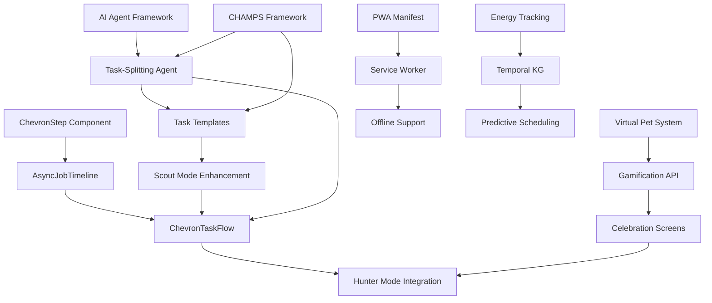

# 🎯 Proxy Agent Platform - Complete Vision Synthesis

**Last Updated**: 2025-01-28
**Document Type**: Strategic Overview
**Purpose**: Unified vision across all project documentation, roadmaps, and designs

---

## 📊 Table of Contents

1. [Executive Summary](#executive-summary)
2. [The Core Problem We're Solving](#the-core-problem-were-solving)
3. [Platform Architecture](#platform-architecture)
4. [The Big Picture: All Major Systems](#the-big-picture-all-major-systems)
5. [Current State Analysis](#current-state-analysis)
6. [Active Roadmap Integration](#active-roadmap-integration)
7. [Design Philosophy](#design-philosophy)
8. [Technical Foundation](#technical-foundation)
9. [Next 12 Months](#next-12-months)
10. [Success Metrics](#success-metrics)

---

## 📋 Executive Summary

### What Is This Platform?

**Proxy Agent Platform** is an **ADHD-optimized productivity system** that combines:
- **AI-powered task management** (intelligent agents)
- **Biological workflow design** (Scout/Hunter/Mender/Mapper modes)
- **Evidence-based gamification** (XP, creatures, achievements)
- **Mobile-first UX** (chevron progress indicators, swipeable cards)
- **Temporal intelligence** (energy tracking, pattern recognition)

### The North Star

> **Transform productivity for ADHD brains by making task completion feel rewarding, achievable, and aligned with biological rhythms—not overwhelming.**

### Key Differentiators

1. **ADHD-First Design** - Not an afterthought, but the foundational principle
2. **Chevron Progress System** - Visual journey (not just progress bars)
3. **Biological Circuits** - 5 modes matching natural brain states
4. **Intelligent Agents** - AI that understands context, not just tasks
5. **Creature Companions** - Emotional engagement through gamification
6. **Temporal Awareness** - Tasks matched to energy and time

---

## 🧠 The Core Problem We're Solving

### The ADHD Challenge

People with ADHD struggle with **executive dysfunction**:

| Challenge | Traditional Tools | Our Solution |
|-----------|------------------|--------------|
| **Task Paralysis** | Long, overwhelming to-do lists | Biological modes (one focus at a time) |
| **Difficulty Starting** | Vague task descriptions | Chevron micro-steps (clear next action) |
| **Maintaining Focus** | No feedback during work | Live progress indicators + XP per step |
| **Time Blindness** | Abstract deadlines | Energy-aware scheduling + Pomodoro |
| **Reward Delay** | Only celebrate at task end | Multi-level rewards (step, task, day, streak) |
| **Overwhelm** | All tasks visible always | Contextual filtering (energy, zone, time) |

### Why Existing Tools Fail ADHD Brains

**Todoist/Asana/Trello**: Designed for neurotypical brains
- ❌ Overwhelming lists
- ❌ No dopamine hits for partial progress
- ❌ Abstract due dates
- ❌ No energy matching

**Forest/Habitica**: Gamification without structure
- ✅ Fun rewards
- ❌ No task breakdown
- ❌ No biological workflow
- ❌ No AI assistance

**Our Approach**: **Structure + Stimulation + Intelligence**
- ✅ Clear workflows (biological modes)
- ✅ Visual progress (chevrons)
- ✅ Immediate rewards (per-step XP, creatures)
- ✅ AI agents (context-aware help)
- ✅ Energy matching (right task, right time)

---

## 🏗️ Platform Architecture

### The 3-Layer Stack

```
┌─────────────────────────────────────────────────────────────┐
│                    LAYER 1: USER EXPERIENCE                 │
│  ┌─────────────────────────────────────────────────────┐    │
│  │  Mobile App (React Native planned, Next.js PWA now)  │    │
│  │  - Biological Tabs: Scout/Hunter/Mender/Mapper/Capt │    │
│  │  - Chevron Progress Timelines                        │    │
│  │  - Swipeable Task Cards                             │    │
│  │  - Creature Collection Gallery                      │    │
│  └─────────────────────────────────────────────────────┘    │
└─────────────────────────────────────────────────────────────┘

┌─────────────────────────────────────────────────────────────┐
│                  LAYER 2: INTELLIGENCE LAYER                │
│  ┌──────────────┐ ┌──────────────┐ ┌──────────────┐        │
│  │ Task Agent   │ │ Focus Agent  │ │ Energy Agent │        │
│  │ (Breakdown)  │ │ (Pomodoro)   │ │ (Prediction) │        │
│  └──────────────┘ └──────────────┘ └──────────────┘        │
│  ┌──────────────┐ ┌──────────────┐ ┌──────────────┐        │
│  │ Split Agent  │ │ Compass Agent│ │ Gamif. Agent │        │
│  │ (Micro-steps)│ │ (Life Zones) │ │ (XP/Rewards) │        │
│  └──────────────┘ └──────────────┘ └──────────────┘        │
└─────────────────────────────────────────────────────────────┘

┌─────────────────────────────────────────────────────────────┐
│                   LAYER 3: DATA FOUNDATION                  │
│  ┌─────────────────────────────────────────────────────┐    │
│  │  PostgreSQL (production) / SQLite (dev)             │    │
│  │  - Tasks (hierarchical micro-steps)                 │    │
│  │  - Energy snapshots (temporal tracking)             │    │
│  │  - Focus sessions (Pomodoro history)                │    │
│  │  - Compass zones (Work/Life/Self)                   │    │
│  │  - Creatures (collection + leveling)                │    │
│  │  - Gamification (XP, streaks, achievements)         │    │
│  └─────────────────────────────────────────────────────┘    │
└─────────────────────────────────────────────────────────────┘
```

### Technology Stack

**Backend**:
- FastAPI (Python 3.11+)
- SQLAlchemy (ORM)
- Pydantic (validation)
- PydanticAI (agent framework)
- Alembic (migrations)
- UV (package manager)

**Frontend**:
- Next.js 14 (React 18)
- TypeScript
- Tailwind CSS
- Framer Motion (animations)
- OpenMoji (emoji library)
- Storybook (component dev)

**AI/ML**:
- Claude 3.5 Sonnet (task breakdown, intent detection)
- Anthropic API
- Custom prompt engineering
- Pattern learning (user feedback)

**Infrastructure**:
- PostgreSQL (production DB)
- SQLite (dev/testing)
- Vercel (frontend hosting)
- Railway/Fly.io (backend hosting - planned)

---

## 🌟 The Big Picture: All Major Systems

### 1. **Biological Workflow** (ADHD-Optimized Modes)

The **5 Biological Circuits** match natural ADHD brain states:

#### **🧲 Capture Mode** - Brain Dump
**Purpose**: Offload mental clutter instantly

**Features**:
- Large text area (no distractions)
- Voice input (Web Speech API)
- Auto vs Manual parsing modes
- Recent captures (context memory)
- Success animations (dopamine hit)

**ADHD Optimization**:
- ✅ No decision fatigue (one big field)
- ✅ Immediate feedback (visual confirmation)
- ✅ Low friction (voice or type)

---

#### **🔍 Scout Mode** - Discover & Prioritize
**Purpose**: Find the right task for right now

**Features**:
- **Category Rows** (horizontal scrolling):
  - 🔥 Main Focus (high priority)
  - ⚡ Urgent Today (due today)
  - 🎯 Quick Wins (< 15 min)
  - 📅 This Week (upcoming)
  - 🤖 Can Delegate (digital tasks)
  - 💤 Someday/Maybe (backlog)
- **Smart Recommendations** (AI-powered)
- **Workspace Overview** (in-progress tasks)
- **Zone Balance Widget** (life balance viz)
- **Filter Matrix** (energy, zone, tags)
- **Decision Helper** (compare 2 tasks side-by-side)
- **Mystery Task Bonus** (15% chance for dopamine)

**ADHD Optimization**:
- ✅ Visual categorization (not lists)
- ✅ Surprise rewards (mystery tasks)
- ✅ Energy matching (filter by current energy)
- ✅ One-tap actions (no menu diving)

---

#### **🏹 Hunter Mode** - Single-Task Focus
**Purpose**: Execute one task at a time

**Features**:
- **Swipeable Task Cards** (Tinder-style):
  - Swipe right → Do/Delegate
  - Swipe left → Skip/Archive
- **Streak Counter** (days in a row)
- **Progress Bar** (tasks completed today)
- **Energy Preview** (energy cost indicator)
- **XP Preview** (reward preview)
- **Focus Timer** (Pomodoro integration - planned)

**ADHD Optimization**:
- ✅ One task at a time (no overwhelm)
- ✅ Swipe gestures (mobile-native)
- ✅ Streak motivation (gamification)
- ✅ Clear next action (no thinking required)

---

#### **🛠️ Mender Mode** - Recover & Reflect
**Purpose**: Rest, recover, and process

**Features**:
- **Energy Gauge** (circular visualization)
- **5-Min Wins** (quick recovery tasks)
- **Mindful Breaks** (meditation/walks)
- **Review & Reflect** (weekly prompts)
- **Administrative Tasks** (low-energy work)
- **Mystery Box Rewards** (every 3 sessions)

**ADHD Optimization**:
- ✅ Energy awareness (prevents burnout)
- ✅ Low-effort options (when depleted)
- ✅ Reward milestones (mystery boxes)
- ✅ Reflection prompts (metacognition)

---

#### **🗺️ Mapper Mode** - Plan & Align
**Purpose**: Big-picture view and goal alignment

**Current Structure** (5 tabs):
1. **📊 Overview** - Level, XP, streak, weekly stats
2. **🏆 Achievements** - Badge gallery
3. **💭 Reflect** - Weekly reflection prompts
4. **🌅/🌙 Rituals** - Morning/evening routines (time-aware)
5. **🧭 Vision** - Focus areas, values, quarterly themes

**Planned Restructure** ([MAPPER_SUBTABS_BRAINSTORM.md](design/MAPPER_SUBTABS_BRAINSTORM.md)):
- **MAP Tab** (Where am I?): Dashboard, Achievements, Reflection, Trends
- **PLAN Tab** (Where going?): Rituals, Vision, Active Goals, Time Horizons
- **MiniChevronNav**: Sticky section indicator (reduces tabs from 5 → 2)

**ADHD Optimization**:
- ✅ Visual progress (charts, XP bars)
- ✅ Gamification (achievements, levels)
- ✅ Time-aware rituals (6-11am, 6-11pm auto-open)
- ✅ Simplified navigation (2 tabs vs 5)

---

### 2. **Chevron Progress System** ([PRD](PRD_ADHD_APP.md) Core Feature)

**What Are Chevrons?**

Chevrons are **arrow-shaped progress indicators** that visually represent a task's journey through micro-steps:

```
┌─────────────────────────────────────────────────────┐
│  Task: "Write blog post"                           │
├─────────────────────────────────────────────────────┤
│  /-----\/-----\/-----\/-----\/-----\               │
│  |  ✅ ||  ✅ ||  🔄 ||     ||     |               │
│  \-----/\-----/\-----/\-----/\-----/               │
│  Draft   Edit   Review Publish Share               │
│  (done)  (done) (active)(next) (pending)           │
└─────────────────────────────────────────────────────┘
```

**Current Implementation**:
- ✅ **AsyncJobTimeline.tsx** - Production-ready component
- ✅ **ChevronStep.tsx** - SVG-based true chevron shapes
- ✅ State-based styling (pending, active, done, error, next)
- ✅ Animations (pulse, shimmer, jiggle for "next")
- ✅ Hierarchical decomposition (nested timelines)
- ✅ Active progress overlays (percentage indicators)
- ✅ Musical timing (4/4 time at 120 BPM for emoji transitions!)

**State Indicators**:
| State | Visual | Emoji | Meaning |
|-------|--------|-------|---------|
| **Pending** | Grayscale, engraved | Black & White | Not started |
| **Active** | Blue tint, pulsing | Blend animation | In progress |
| **Next** | Orange tint, jiggle | Black & White | Up next (nudge) |
| **Done** | Green tint, embossed | Colorful | Completed! |
| **Error** | Red tint | Colorful + ⚠️ | Failed, retry |

**ADHD Psychology**:
- **Zeigarnik Effect**: Incomplete chevrons create gentle tension to finish
- **Immediate Feedback**: Each step completion = dopamine hit
- **Visual Progress**: See journey, not just end goal
- **Safe Urgency**: "Next" jiggle nudges without anxiety

**Integration Planned** ([INTEGRATION_ROADMAP.md](roadmap/INTEGRATION_ROADMAP.md)):
- **Week 1-2**: ChevronTaskFlow (full-screen step-by-step execution)
- **Week 3**: Mapper MiniChevronNav (sticky section indicator)
- **Week 4+**: All modes use chevrons for multi-step flows

---

### 3. **Task-Splitting System** ([master-roadmap.md](task-splitting/master-roadmap.md))

**Epic 7: ADHD-First Task Splitting**

**Purpose**: Break overwhelming tasks into 2-5 minute micro-steps

**The Problem**:
- Tasks like "Write report" are too vague → paralysis
- ADHD brains need **concrete next actions**

**The Solution**:
```
Input: "Write quarterly report"
    ↓
AI Decomposition:
    1. [2 min] 📋 Create outline (headings only)
    2. [3 min] 📊 Gather Q4 metrics (copy from dashboard)
    3. [5 min] ✍️ Write intro paragraph (150 words)
    4. [5 min] 📝 Draft "Wins" section (bullet points)
    5. [3 min] 🔍 Proofread first page
    ↓
Output: 5 micro-steps, each < 5 minutes
```

**Features**:
- **Auto-Chunker**: AI-powered task breakdown (PydanticAI)
- **Micro-Steps**: 2-5 minute actions (ADHD attention span)
- **Delegation Detection**: "🤖 Can delegate to agent"
- **Scope Classification**: ATOM (do now) vs MOLECULE (split further)
- **Voice Command**: "Split this task" (mobile)
- **XP Per Step**: Rewards per micro-step, not just full task

**Status**: Epic 7 (8-week roadmap ready, not started)

---

### 4. **Gamification System** (XP + Creatures + Achievements)

#### **XP System** (MVP Complete)

**Exponential Level Curve**:
```python
# Level 1 → 2: 100 XP
# Level 2 → 3: 200 XP
# Level 10 → 11: ~2,600 XP
xp_for_next_level = 100 * (level ** 1.5)
```

**XP Sources**:
| Action | XP Earned | Notes |
|--------|-----------|-------|
| Complete task | 25-100 | Based on priority (low/med/high) |
| Complete micro-step | 10-25 | Per-step rewards (planned) |
| Pomodoro session | 50-75 | 25-min focus + 25 bonus |
| Daily login | 10 | Streak maintenance |
| Achievement unlock | 50-500 | One-time bonuses |

**Planned Enhancements** ([INTEGRATION_ROADMAP.md](roadmap/INTEGRATION_ROADMAP.md)):
- **Week 7**: Per-step XP (not just per-task)
- **Week 7**: Unlockable themes (color palettes for chevrons)
- **Week 7**: Badge system (20+ badges)
- **Week 8**: Celebration screens (confetti, stats)

---

#### **Creature Collection System** ([CREATURE_COLLECTION_SYSTEM.md](archive/CREATURE_COLLECTION_SYSTEM.md))

**Status**: Archived design doc, not implemented yet

**Concept**: Pokemon-inspired creature companions

**Core Mechanics**:
1. **Starter Creatures**: 2 unique AI-generated pets on signup
   - Guaranteed: 1 Uncommon + 1 Rare
   - Bound to user (can't trade starters)
2. **Rarity Tiers**: Common (45%) → Uncommon (30%) → Rare (15%) → Epic (7%) → Legendary (2.5%) → Mythic (0.5%)
3. **Evolution Stages**: Baby → Teen → Adult → Elite → Master → Legendary → Mythic
4. **Leveling**: Creatures gain XP from task completion
5. **Social Collection**: Trade/collect creatures from friends

**Visual Generation**:
- AI-generated images (Stable Diffusion or similar)
- Unique seed per creature (reproducible)
- Color palettes match rarity

**Integration with PRD**:
- **Week 5-6**: Virtual pet system (simplified version)
- Feeds on task XP (Tamagotchi-style)
- Unlockable species (not full Pokemon system)
- Focus on **one pet**, not collection initially

**Decision**: Start simple (1 pet per user), expand to collection later

---

#### **Achievements & Streaks** (MVP Complete)

**Current Achievements**:
- First task completed
- 3-day streak
- 7-day streak
- Level milestones (5, 10, 20)

**Planned Badges** ([INTEGRATION_ROADMAP.md](roadmap/INTEGRATION_ROADMAP.md) Week 7):
- **Streak Badges**: 3-day, 7-day, 30-day, 100-day
- **Volume Badges**: 10/100/500 steps completed
- **Speed Badges**: Morning Warrior (3 tasks before 9am), Night Owl (task after 10pm)
- **Specialty Badges**: Quick Win Master, Marathon Runner, Pet Whisperer

---

### 5. **Energy & Temporal Systems**

#### **Energy Tracking** (MVP Complete)

**Current Implementation**:
- **3-Level Selector**: Low (1), Medium (2), High (3)
- **Energy Snapshots**: Timestamped history in DB
- **API Endpoints**: `/energy/set`, `/energy/current`, `/energy/history`

**Planned Enhancements** ([ENERGY_ESTIMATION_DESIGN.md](design/ENERGY_ESTIMATION_DESIGN.md)):
- **Predictive Model**: ML-based energy forecasting
- **Task-Energy Matching**: "Ready Now" tasks based on current energy
- **Energy Insights**: "You're most productive 9-11am"
- **Burnout Prevention**: Red flags when energy stays low

**ADHD Value**:
- ✅ Prevents overcommitment (energy awareness)
- ✅ Right task, right time (energy matching)
- ✅ Pattern recognition (learn your rhythms)

---

#### **Temporal Knowledge Graph** ([TEMPORAL_KG_DESIGN.md](design/TEMPORAL_KG_DESIGN.md))

**Status**: Designed, not implemented

**Concept**: Time-aware data structure that tracks:
- Task completion patterns by hour/day/week
- Energy levels over time
- Context (location, weather, mood)
- Relationships (task → energy → outcome)

**Future Value**:
- Predictive scheduling ("Do this task at 10am when you're usually energized")
- Adaptive nudges ("It's 3pm, try a quick win instead")
- Retrospective insights ("You complete 70% of tasks in morning")

**Timeline**: Post-MVP, likely 6+ months out

---

#### **Compass Zones** (MVP Complete)

**3-Zone Life Organization**:
1. **💼 Work** - Career, projects, professional growth
2. **🏠 Life** - Family, home, errands, social
3. **❤️ Self** - Health, hobbies, learning, rest

**Features**:
- Simple goals (not abstract purpose statements)
- Task count tracking (not hour goals)
- Max 5 zones (keeps it manageable)
- Auto-created on signup

**ADHD Value**:
- ✅ Visual life balance (pie chart)
- ✅ Zone-based filtering ("Show me Work tasks")
- ✅ Neglect alerts ("No Self tasks in 7 days")

---

### 6. **CHAMPS Framework** ([CHAMPS_FRAMEWORK.md](design/CHAMPS_FRAMEWORK.md))

**AI-Powered Success Criteria for Micro-Steps**

**What Is CHAMPS?**

Adapted from classroom management framework, CHAMPS tags each micro-step with 6 dimensions:

| Dimension | Question | Tags | Example |
|-----------|----------|------|---------|
| **C**onversation | Talk level? | 💬 Communication, 🔇 Silent, 👥 Collaboration | "🔇 Silent" for "Review document" |
| **H**elp | How to verify? | 💾 Save Progress, ✅ Verify, 🔍 Research | "✅ Verify" for "Proofread email" |
| **A**ctivity | What doing? | 📝 Write, 📖 Read, 🎨 Create, 🧹 Clean | "📝 Write" for "Draft intro" |
| **M**ovement | Where? | 🏢 Office, 🏠 Home, 🌍 Anywhere | "🌍 Anywhere" for "Review notes" |
| **P**articipation | Energy cost? | ⚡ High, 🔋 Medium, 🪫 Low | "🔋 Medium" for "Write outline" |
| **S**uccess | Done when? | ✅ Specific criteria | "✅ 3 bullet points written" |

**Why It Matters**:
- **Reduces anxiety**: Clear expectations
- **Improves task selection**: Filter by current context (energy, location, noise)
- **Increases completion**: Know when you're done

**Status**: Framework designed, implementation planned for Epic 7 (Task-Splitting)

---

## 📍 Current State Analysis

### What's Built ✅

**Backend (95% MVP Complete)**:
- ✅ Task management API (CRUD, hierarchical micro-steps)
- ✅ Energy tracking (3-level selector, history)
- ✅ Focus sessions (Pomodoro timer)
- ✅ Gamification (XP, levels, streaks)
- ✅ Compass zones (Work/Life/Self)
- ✅ Database schema (PostgreSQL/SQLite)
- ✅ Repository pattern (clean architecture)
- ✅ PydanticAI agents (capture, focus, energy)

**Frontend (70% MVP Complete)**:
- ✅ Biological tabs (Scout/Hunter/Mender/Mapper/Capture)
- ✅ ChevronStep component (SVG chevrons)
- ✅ AsyncJobTimeline (nested timelines)
- ✅ EnergyGauge (circular viz)
- ✅ SwipeableTaskCard (mobile gestures)
- ✅ Voice input (Web Speech API)
- ✅ Design system (4px grid, Solarized colors)
- ✅ Storybook (component development)

**Documentation (90% Complete)**:
- ✅ PRD (comprehensive vision)
- ✅ Integration Roadmap (12-week plan)
- ✅ Phase 1 Specs (technical details)
- ✅ ADHD Task Management Master
- ✅ CHAMPS Framework
- ✅ Component Catalog
- ✅ API Reference

### What's In Progress 🚧

**Current Week**: Week 1 of Integration Roadmap

**Active Tasks**:
- 🚧 ChevronTaskFlow component (full-screen step execution)
- 🚧 Mapper restructure (5 tabs → 2 tabs MAP/PLAN)
- 🚧 MiniChevronNav (sticky section indicator)

**Known Issues**:
- 🐛 ChevronStep icon rendering (OpenMoji not showing inside parallelograms)
- 🐛 AsyncJobTimeline chevron interlocking (overlap not perfect)

### What's Planned 📅

**Next 12 Weeks** ([INTEGRATION_ROADMAP.md](roadmap/INTEGRATION_ROADMAP.md)):

| Phase | Weeks | Focus | Key Deliverables |
|-------|-------|-------|------------------|
| **Phase 1** | 1-3 | Chevron-ify existing modes | ChevronTaskFlow, Mapper restructure |
| **Phase 2** | 4-6 | Enhanced gamification | Templates, virtual pet, badges |
| **Phase 3** | 7-9 | Mobile optimization | PWA, focus timer, celebration screens |
| **Phase 4** | 10-12 | Advanced features | AI suggestions, analytics, user testing |

**Next 6-12 Months**:
- Epic 7: Task-Splitting System (8 weeks)
- Creature Collection System (simplified version)
- Temporal Knowledge Graph (backend)
- React Native mobile app (if PWA validates demand)

---

## 🧩 Active Roadmap Integration

### How All The Pieces Fit Together

```
┌─────────────────────────────────────────────────────────────┐
│              UNIFIED PRODUCT ROADMAP                        │
├─────────────────────────────────────────────────────────────┤
│                                                             │
│  NOW (Weeks 1-3): Phase 1 - Chevron Integration            │
│  ├─ ChevronTaskFlow (step-by-step execution)               │
│  ├─ Mapper MAP/PLAN split (reduce overwhelm)               │
│  └─ MiniChevronNav (spatial awareness)                     │
│                                                             │
│  NEXT (Weeks 4-6): Phase 2 - Gamification                  │
│  ├─ Task templates (pre-built step patterns)               │
│  ├─ Virtual pet system (Tamagotchi-style)                  │
│  └─ Per-step rewards (XP, badges, themes)                  │
│                                                             │
│  SOON (Weeks 7-9): Phase 3 - Mobile UX                     │
│  ├─ PWA (installable app)                                  │
│  ├─ Focus timer per step (Pomodoro)                        │
│  └─ Celebration screens (confetti, pet feed)               │
│                                                             │
│  LATER (Weeks 10-12): Phase 4 - Intelligence               │
│  ├─ AI step suggestions (auto-decomposition)               │
│  ├─ Analytics dashboard (Trends tab)                       │
│  └─ Pattern insights ("You're best 9-11am")                │
│                                                             │
│  FUTURE (3-6 months):                                       │
│  ├─ Epic 7: Task-Splitting (CHAMPS framework)              │
│  ├─ Creature collection expansion                          │
│  ├─ Temporal knowledge graph                               │
│  ├─ React Native mobile app                                │
│  └─ Team collaboration features                            │
│                                                             │
└─────────────────────────────────────────────────────────────┘
```

### Dependency Map



### Strategic Alignment

**All roadmaps align on**:
1. **ADHD-first**: Every feature optimized for executive dysfunction
2. **Chevrons everywhere**: Consistent visual language
3. **Immediate rewards**: Dopamine at every level (step, task, day)
4. **Progressive enhancement**: Keep existing, add new
5. **Mobile-first**: Touch-friendly, swipeable, voice-enabled

---

## 🎨 Design Philosophy

### Core Principles

#### 1. **Simplicity Over Features**
> "Subtract until it breaks, then add back one piece."

- ❌ 17 API endpoints → ✅ 9 core endpoints (47% reduction)
- ❌ 5 biological tabs → ✅ 3 main views (for new users)
- ❌ Complex algorithms → ✅ Simple, understandable logic

#### 2. **Immediate Feedback**
> "Every action gets a visible reaction."

- Tap task → Chevron lights up
- Complete step → Green + XP notification
- Login daily → Streak counter increments
- Feed pet → Happy animation

#### 3. **Visual Over Textual**
> "Show, don't tell."

- Chevron progress (not % numbers)
- Energy gauge (not "70% energy")
- Zone pie chart (not task counts)
- Creature sprites (not text descriptions)

#### 4. **Friction Reduction**
> "Remove every unnecessary click, decision, and wait."

- Voice input (no typing)
- Auto-mode (no parsing decisions)
- Swipe gestures (no button taps)
- Templates (no blank page syndrome)

#### 5. **Celebration Over Punishment**
> "Reward partial progress, never punish lapses."

- ✅ XP per step (not just full task)
- ✅ Celebration screens (confetti on complete)
- ❌ No streak-breaking penalties
- ❌ No overdue red alerts (gentle nudges only)

---

### UX Patterns

#### **Mobile-First**
- Thumb-friendly (all actions in bottom 2/3 of screen)
- Swipe gestures (native to mobile)
- Large tap targets (min 44x44px)
- Voice input (hands-free)

#### **Minimal Overwhelm**
- One task at a time (Hunter mode)
- One section at a time (snap-scrolling)
- One decision at a time (swipe left/right)
- One metric at a time (focus on XP, not all stats)

#### **Progressive Disclosure**
- Defaults work out-of-box (no setup required)
- Advanced features opt-in (not forced)
- Settings in dedicated screen (not cluttering main UI)
- Onboarding tutorial (one-time, skippable)

---

### Visual Language

**Colors** (Solarized Theme):
```
Accent Colors:
- Blue (#268bd2): Active, focus, primary actions
- Green (#859900): Success, completed, growth
- Orange (#cb4b16): Next, warning, urgency (safe)
- Red (#dc322f): Error, critical (never punitive)
- Yellow (#b58900): Rewards, XP, highlights

Background Colors:
- Light Cream (#fdf6e3): Primary background
- Darker Cream (#eee8d5): Secondary background
- Dark Blue-Gray (#073642): Text, headers
- Gray (#586e75): Secondary text
```

**Typography**:
- System font (native feel)
- 4px spacing grid (consistent rhythm)
- Max line length: 60 characters (readability)
- Line height: 1.5 (breathing room)

**Animations**:
- Pulse (attention)
- Shimmer (progress)
- Jiggle (nudge)
- Confetti (celebration)
- Fade (transitions)
- Slide (navigation)

---

## 🛠️ Technical Foundation

### Backend Architecture

**Clean Architecture** (layered approach):

```
┌─────────────────────────────────────────────────┐
│  API Layer (FastAPI routes)                    │
│  - /tasks, /energy, /focus, /gamification      │
└─────────────────────────────────────────────────┘
          ↓
┌─────────────────────────────────────────────────┐
│  Agent Layer (PydanticAI)                      │
│  - Task Agent, Focus Agent, Energy Agent       │
└─────────────────────────────────────────────────┘
          ↓
┌─────────────────────────────────────────────────┐
│  Repository Layer (SQLAlchemy)                 │
│  - TaskRepository, EnergyRepository, etc.      │
└─────────────────────────────────────────────────┘
          ↓
┌─────────────────────────────────────────────────┐
│  Database Layer (PostgreSQL/SQLite)            │
│  - Tasks, Energy, Focus, Gamification tables   │
└─────────────────────────────────────────────────┘
```

**Key Patterns**:
- **Repository Pattern**: Abstraction over database access
- **Dependency Injection**: Services/repos injected, not hardcoded
- **Pydantic Models**: Validation at API boundary
- **Agent Framework**: PydanticAI for AI-powered logic
- **Migrations**: Alembic for schema versioning

---

### Frontend Architecture

**Component Structure**:

```
src/
├── components/
│   ├── mobile/                 # Mobile-specific components
│   │   ├── modes/              # Biological mode screens
│   │   │   ├── CaptureMode.tsx
│   │   │   ├── ScoutMode.tsx
│   │   │   ├── HunterMode.tsx
│   │   │   ├── MenderMode.tsx
│   │   │   └── MapperMode.tsx
│   │   ├── ChevronStep.tsx     # Parallelogram progress step
│   │   ├── BiologicalTabs.tsx  # Bottom navigation
│   │   ├── EnergyGauge.tsx     # Circular energy viz
│   │   └── ...
│   ├── shared/                 # Reusable across web/mobile
│   │   ├── AsyncJobTimeline.tsx # Nested chevron timeline
│   │   ├── OpenMoji.tsx        # Emoji component
│   │   ├── ProgressBar.tsx     # Generic progress bar
│   │   └── ...
│   └── tasks/                  # Task-specific components
│       ├── TaskList.tsx
│       ├── TaskCard.tsx
│       └── QuickCapture.tsx
├── lib/
│   ├── design-system.ts        # Spacing, colors, fonts
│   ├── api.ts                  # API client
│   └── utils.ts                # Helper functions
└── app/
    ├── mobile/                 # Mobile routes
    │   ├── capture/page.tsx
    │   ├── scout/page.tsx
    │   └── ...
    └── page.tsx                # Landing page
```

**Key Patterns**:
- **Atomic Design**: Components → Organisms → Templates → Pages
- **Compound Components**: Parent/child pattern (e.g., Timeline + Steps)
- **Hooks**: Custom hooks for shared logic (useEnergy, useFocus)
- **Context**: Global state (user, theme, settings)
- **TypeScript**: Strict typing, no `any`

---

### Data Models

**Core Entities**:

```typescript
// Task (hierarchical)
interface Task {
  task_id: UUID;
  user_id: string;
  title: string;
  description?: string;
  status: 'pending' | 'in_progress' | 'completed' | 'archived';
  priority: 'low' | 'medium' | 'high';
  zone_id?: UUID;                    // Compass zone
  parent_task_id?: UUID;             // For hierarchy
  micro_steps: MicroStep[];          // Child steps
  estimated_minutes?: number;
  due_date?: datetime;
  tags?: string[];
  created_at: datetime;
  updated_at: datetime;
}

// MicroStep (task decomposition)
interface MicroStep {
  step_id: UUID;
  task_id: UUID;                     // Parent task
  description: string;
  short_label?: string;
  status: 'pending' | 'active' | 'done' | 'error';
  estimated_minutes: number;
  leaf_type: 'DIGITAL' | 'HUMAN';
  icon?: string;                     // Emoji
  order: number;                     // Position in sequence
  champs_tags?: CHAMPSTags;          // CHAMPS framework (planned)
  xp_earned?: number;
  completed_at?: datetime;
}

// Energy Snapshot (temporal tracking)
interface EnergySnapshot {
  snapshot_id: UUID;
  user_id: string;
  energy_level: 1 | 2 | 3;           // Low/Med/High
  timestamp: datetime;
  context?: {
    time_of_day: 'morning' | 'afternoon' | 'evening' | 'night';
    day_of_week: string;
    location?: string;
    mood?: string;
  };
}

// Compass Zone (life organization)
interface CompassZone {
  zone_id: UUID;
  user_id: string;
  name: string;                      // "Work", "Life", "Self"
  icon: string;                      // 💼, 🏠, ❤️
  color: string;                     // Hex color
  simple_goal: string;               // "Build great products"
  tasks_completed_today: number;
  tasks_completed_this_week: number;
  tasks_completed_all_time: number;
}

// User Pet (gamification)
interface UserPet {
  pet_id: UUID;
  user_id: string;
  species: string;                   // "Fluffernox", "Sparkwing"
  name: string;                      // User-assigned nickname
  level: number;                     // 1-100
  xp: number;
  hunger: number;                    // 0-100
  happiness: number;                 // 0-100
  evolution_stage: number;           // 1 (baby), 2 (teen), 3 (adult)
  created_at: datetime;
  last_fed_at: datetime;
}

// Gamification Progress
interface UserProgress {
  user_id: string;
  total_xp: number;
  current_level: number;
  xp_to_next_level: number;
  current_streak_days: number;
  longest_streak_days: number;
  tasks_completed_total: number;
  achievements_unlocked: string[];   // Badge IDs
  active_theme: string;              // "solarized", "neon", etc.
  unlocked_themes: string[];
}
```

---

## 🚀 Next 12 Months

### Q1 2025 (Jan-Mar): MVP → Integration

**Goals**:
- ✅ Complete MVP backend (DONE)
- ✅ Complete MVP frontend modes (DONE)
- ✅ Integration Roadmap (DONE)
- 🚧 Phase 1: Chevron integration (Week 1-3, IN PROGRESS)
- 📅 Phase 2: Gamification (Week 4-6)
- 📅 Phase 3: Mobile UX (Week 7-9)
- 📅 Phase 4: Intelligence (Week 10-12)

**Milestones**:
- [ ] Week 3: ChevronTaskFlow working in Hunter mode
- [ ] Week 6: Virtual pet feeding animation complete
- [ ] Week 9: PWA installable on iOS/Android
- [ ] Week 12: 5-10 ADHD users testing + positive feedback

---

### Q2 2025 (Apr-Jun): Task-Splitting + Creatures

**Goals**:
- Epic 7: Task-Splitting System (8 weeks)
- Creature collection (simplified version)
- User testing (20+ ADHD volunteers)
- React Native exploration (if PWA validates)

**Milestones**:
- [ ] Month 4: CHAMPS framework implemented
- [ ] Month 5: Auto-decomposition working (AI)
- [ ] Month 6: 100+ active users, 80%+ retention

---

### Q3 2025 (Jul-Sep): Temporal Intelligence

**Goals**:
- Temporal Knowledge Graph (backend)
- Predictive energy modeling
- Adaptive scheduling
- Pattern insights dashboard

**Milestones**:
- [ ] Month 7: Energy prediction 70%+ accurate
- [ ] Month 8: "Right task, right time" matching live
- [ ] Month 9: Insights dashboard in Mapper→Trends

---

### Q4 2025 (Oct-Dec): Scale + Business

**Goals**:
- React Native mobile app (if validated)
- Team collaboration features (shared tasks, zones)
- Monetization (freemium model)
- Marketing + growth

**Milestones**:
- [ ] Month 10: Mobile app beta (TestFlight/APK)
- [ ] Month 11: Team features live
- [ ] Month 12: 1,000+ active users, paying customers

---

## 📈 Success Metrics

### North Star Metric
**Task Completion Rate**: % of started tasks that get fully completed

**Target**: 60% (vs industry avg 30% for ADHD users)

---

### Key Performance Indicators (KPIs)

#### **User Engagement**
| Metric | Current | Target (Week 12) | Target (Year 1) |
|--------|---------|------------------|-----------------|
| Daily Active Users | 1 (dev) | 10 (testers) | 500 |
| Session Duration | N/A | 15+ min | 20+ min |
| Sessions Per Week | N/A | 5+ | 7+ (daily use) |
| Retention (Week 2) | N/A | 70% | 80% |

#### **Task Metrics**
| Metric | Target (Week 12) | Target (Year 1) |
|--------|------------------|-----------------|
| Tasks Created/Week | 10+ per user | 15+ per user |
| Tasks Completed/Week | 6+ per user (60% rate) | 10+ per user (67% rate) |
| Micro-Steps Completed | 20+ per user/week | 40+ per user/week |
| Average Steps Per Task | 3-5 | 4-6 |

#### **Gamification**
| Metric | Target (Week 12) | Target (Year 1) |
|--------|------------------|-----------------|
| Average User Level | 3-5 | 10-15 |
| Total XP Earned | 500+ per user | 5,000+ per user |
| Longest Streak | 7+ days | 30+ days |
| Pet Interactions | 50%+ users daily | 70%+ users daily |

#### **ADHD-Specific**
| Metric | How Measured | Target |
|--------|--------------|--------|
| Task Initiation Time | Time from "Capture" to "Start" | < 5 min |
| Focus Session Completion | % of 25-min Pomodoros finished | 70%+ |
| Energy-Task Match Accuracy | User reports "right task" | 80%+ |
| Overwhelm Reduction | User survey (1-10 scale) | 7+ avg |

---

### Qualitative Goals

**User Feedback**:
- "This app makes me feel like I'm making progress" (70%+ agree)
- "Chevrons help me see the journey, not just the end" (60%+ agree)
- "I actually WANT to open this app daily" (50%+ agree)
- "My pet motivates me to complete tasks" (60%+ agree)

**ADHD-Friendliness Rating**: 7.5+/10 avg (from user testing)

**Net Promoter Score (NPS)**: 40+ (excellent for MVP)

---

## 🎯 Conclusion

### What Makes This Platform Unique?

1. **Evidence-Based ADHD Design**: Every feature backed by research (PRD references)
2. **Biological Workflow**: 5 modes matching natural brain states
3. **Chevron Visual Language**: Progress as a journey, not a checklist
4. **Multi-Level Rewards**: Dopamine hits at step, task, day, streak levels
5. **Temporal Intelligence**: Energy-aware, pattern-learning, predictive
6. **Creature Companions**: Emotional engagement through gamification
7. **Mobile-First**: Touch-friendly, voice-enabled, swipeable

### The Vision in One Sentence

> **Make productivity feel like a rewarding game that ADHD brains actually want to play—not a guilt-inducing to-do list they dread opening.**

---

### Next Actions

**For You (Product Owner)**:
1. Review this synthesis document
2. Confirm strategic alignment
3. Choose starting point:
   - 🏗️ Build ChevronTaskFlow (Week 1-2 task)
   - 🎨 Design pet species sprites (Week 5-6 prep)
   - 👥 Recruit ADHD testers (Week 12 prep)

**For Development**:
1. Continue Phase 1: Chevron integration (in progress)
2. Weekly demos (Friday 4pm)
3. Daily standups (Monday/Wednesday 9am)

**For Community**:
1. Discord server for beta testers (set up in Week 4)
2. User interviews (start recruiting now)
3. Weekly feedback sessions (after Week 6)

---

**Let's build something that genuinely helps ADHD brains thrive!** 🚀

---

**Document Metadata**:
- **Created**: 2025-01-28
- **Author**: Claude (Sonnet 4.5) + Shrenil Patel
- **Sources**: 80+ project documents synthesized
- **Next Review**: End of Phase 1 (Week 3)
- **Updates**: Weekly as roadmap progresses
