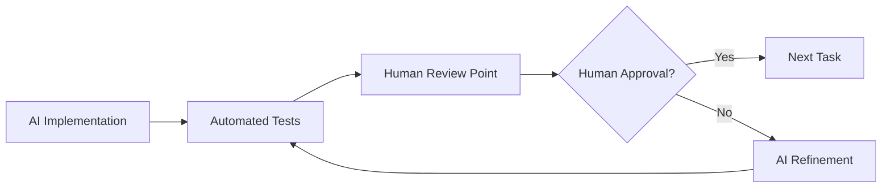

# 🛠️ Proxy Agent Platform - Tech Stack

## 🎯 **Core Technology Decisions**

### **🤖 AI Framework (LOCKED)**
- **PydanticAI**: Core AI agent framework
  - Version: `>=0.0.14` with all providers (`anthropic,openai,gemini,ollama`)
  - Rationale: Type-safe agents, structured outputs, multi-provider support
  - Integration: Powers all 4 proxy agent types

### **🐍 Backend Stack (LOCKED)**
- **FastAPI**: Web framework for API server
  - Version: Latest stable
  - Rationale: Async support, automatic OpenAPI docs, Python ecosystem
- **PostgreSQL**: Primary database
  - Version: 14+
  - Rationale: ACID compliance, JSON support, proven scalability
- **Alembic**: Database migrations
  - Version: Latest with SQLAlchemy 2.0+
  - Rationale: Version control for database schema
- **Pydantic v2**: Data validation and settings
  - Version: `>=2.0.0`
  - Rationale: Type safety, validation, seamless FastAPI integration

### **⚛️ Frontend Stack (LOCKED)**
- **Next.js 14+**: React framework with App Router
  - Version: `>=14.0.0`
  - Rationale: Server components, optimized performance, TypeScript support
- **TypeScript**: Type-safe frontend development
  - Version: Latest stable
  - Rationale: Developer experience, maintainability, error prevention
- **Tailwind CSS**: Utility-first styling
  - Version: Latest stable
  - Rationale: Rapid development, consistent design system
- **CopilotKit**: AI chat integration
  - Version: Latest stable
  - Rationale: Natural language interaction with proxy agents

### **🔧 Development Tools (LOCKED)**
- **UV**: Python package management
  - Version: Latest
  - Rationale: 10-100x faster than pip, reliable dependency resolution
- **Ruff**: Python linting and formatting
  - Version: Latest
  - Rationale: Extremely fast, replaces multiple tools (Black, isort, flake8)
- **Pytest**: Testing framework
  - Version: Latest
  - Rationale: Powerful fixtures, extensive plugin ecosystem
- **Mypy**: Static type checking
  - Version: Latest
  - Rationale: Catch type errors at development time

### **📱 Mobile Integration (LOCKED)**
- **iOS Shortcuts**: Native iOS integration
  - Platform: iOS 14+
  - Rationale: Siri integration, system-level automation
- **Android Quick Settings**: Native Android integration
  - Platform: Android 7+
  - Rationale: One-tap access, notification panel integration
- **PWA Support**: Cross-platform mobile app
  - Standard: Latest PWA standards
  - Rationale: Single codebase, native-like experience

### **🗄️ Database Architecture (LOCKED)**
- **Primary Database**: PostgreSQL
  - Use: User data, agent state, gamification data
- **Time-Series Data**: PostgreSQL with TimescaleDB extension
  - Use: Productivity metrics, energy tracking, performance data
- **Caching**: Redis (optional for production)
  - Use: Session storage, real-time data caching

### **🚀 Deployment (FLEXIBLE)**
- **Development**: Docker Compose
- **Production**: Docker + Kubernetes OR Railway/Vercel
- **Database**: Managed PostgreSQL (AWS RDS, Railway, etc.)

---

## 🧪 **Human Testing Integration**

### **Human-in-the-Loop Development Process**

#### **Phase 1: AI Development + Human Checkpoints**


#### **Human Testing Checkpoints**

**1. Epic Completion Reviews**
- **When**: After each epic completion (every 4-6 weeks)
- **Who**: Product owner + technical reviewer
- **What**: Feature demonstration, user experience testing
- **Output**: Go/no-go decision for next epic

**2. Weekly Progress Reviews**
- **When**: Every Friday
- **Who**: Development team + stakeholders
- **What**: Progress demo, blockers discussion, priority adjustments
- **Output**: Next week priorities and resource allocation

**3. User Acceptance Testing (UAT)**
- **When**: After each major feature implementation
- **Who**: Target users (ADHD professionals, productivity users)
- **What**: Real-world usage scenarios, feedback collection
- **Output**: Feature refinement requirements

**4. Technical Review Gates**
- **When**: Before merging to main branch
- **Who**: Senior developer + AI coding assistant
- **What**: Code quality, architecture decisions, security review
- **Output**: Merge approval or refinement requests

### **Human Testing Framework**

#### **Testing Roles**
- **Product Owner**: Feature validation and business logic review
- **Technical Reviewer**: Code quality and architecture decisions
- **UX Tester**: User experience and usability validation
- **Target Users**: Real-world usage scenarios and feedback

#### **Testing Scenarios**
1. **2-Second Task Capture**: Time actual task capture flows
2. **Mobile Integration**: Test iOS Shortcuts and Android tiles
3. **Gamification Engagement**: Validate XP and streak systems
4. **Agent Effectiveness**: Measure productivity improvements
5. **Energy Optimization**: Test timing suggestions accuracy

#### **Feedback Integration**
- **GitHub Issues**: Technical bugs and enhancement requests
- **User Feedback Board**: Feature requests and usability issues
- **Analytics Dashboard**: Usage metrics and performance data
- **Regular User Interviews**: Qualitative feedback and insights

### **Testing Commands Integration**

#### **Enhanced Commands with Human Review**
```bash
# AI + Human workflow commands
/execute-prp-with-review <prp-file>     # Includes human checkpoint
/deploy-for-testing <epic-name>         # Deploy to testing environment
/collect-feedback <feature-name>        # Gather user feedback
/review-and-refine <implementation>     # Human-AI collaborative refinement
```

#### **Human Testing Tasks in Epics**
Each epic now includes:
- **Demo Preparation**: AI prepares feature demonstration
- **Human Testing Session**: Structured user testing
- **Feedback Integration**: AI processes and implements feedback
- **Quality Gate**: Human approval before epic completion

---

## 📋 **Development Standards (LOCKED)**

### **Code Quality Standards**
- **Line Length**: 100 characters max
- **Function Size**: 50 lines max
- **File Size**: 500 lines max
- **Test Coverage**: 95% minimum
- **Type Coverage**: 100% for public APIs

### **Git Workflow**
- **Main Branch**: `main` (protected, requires reviews)
- **Feature Branches**: `epic/N-feature-name`
- **Testing Branch**: `testing` (for human testing)
- **Deployment**: `production` (for production releases)

### **Testing Strategy**
- **Unit Tests**: Every function and class
- **Integration Tests**: API endpoints and agent communication
- **E2E Tests**: Complete user workflows
- **Performance Tests**: Response time and load testing
- **Human Testing**: UX validation and real-world scenarios

---

## 🎯 **Why These Choices?**

### **Performance Focus**
- **UV**: 10-100x faster package management
- **Ruff**: Extremely fast Python tooling
- **Next.js**: Optimized React performance
- **PostgreSQL**: Proven scalability and performance

### **Developer Experience**
- **TypeScript**: Type safety across frontend and backend
- **Pydantic**: Structured data validation
- **FastAPI**: Automatic API documentation
- **Tailwind**: Rapid UI development

### **AI-First Design**
- **PydanticAI**: Built for structured AI applications
- **CopilotKit**: Seamless AI chat integration
- **FastAPI**: Easy AI model serving
- **Type Safety**: Reduces AI hallucination impact

### **Mobile-First**
- **PWA Support**: Cross-platform mobile experience
- **Native Integrations**: iOS Shortcuts, Android tiles
- **Offline Capability**: Works without internet connection
- **Performance**: 2-second task capture requirement

---

**Tech Stack Status**: ✅ **LOCKED AND FINAL**
**Human Testing**: ✅ **INTEGRATED INTO WORKFLOW**
**Next Step**: Begin Epic 1 implementation with human checkpoints