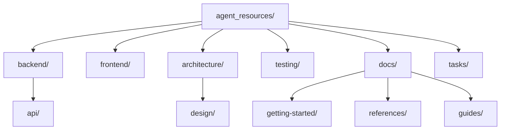
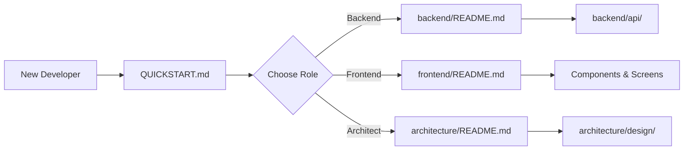

# Documentation Organization - Improvement Roadmap

**Current Score**: 9/10
**Target Score**: 10/10 (Peak efficiency)
**Last Updated**: November 13, 2025

---

## 🎯 Current State Assessment

### ✅ Strengths (What's Working Well)

1. **Clean Structure** - Flattened directories, no unnecessary nesting
2. **Case Consistency** - All lowercase, works on all systems
3. **Navigation** - QUICKSTART.md and SITEMAP.md provide excellent guidance
4. **Role-Based** - Clear separation by developer role
5. **No Duplicates** - Single source of truth for all docs

### 🔴 Remaining Issues (What Could Be Better)

1. **Some dead links** - References to archived/moved docs
2. **README inconsistency** - Some READMEs are sparse
3. **Missing cross-links** - Docs don't link to related content
4. **No search capability** - Must manually browse
5. **Outdated content** - Some docs reference old features

---

## 🚀 Priority 1: Critical Improvements (This Week)

### 1.1 Fix Dead Links (High Priority)

**Problem**: Some docs reference files that were moved/archived.

**Examples Found**:
```markdown
# In tasks/roadmap/next_5_tasks.md
[NEXT_TASKS_PRIORITIZED.md](../../../docs/status/NEXT_TASKS_PRIORITIZED.md)
→ Now in: docs/archive/2025-11-10-status-reports/

# In tasks/roadmap/current_sprint.md
[BE-05 spec](../../../docs/tasks/backend/05_task_splitting_service.md)
→ File may not exist
```

**Solution**:
```bash
# 1. Find all markdown links
rg '\]\([^)]+\.md\)' agent_resources/ -l

# 2. Validate each link exists
# 3. Update or remove broken links
# 4. Add redirects in README files for moved content
```

**Effort**: 2-3 hours
**Impact**: High - Prevents developer confusion

---

### 1.2 Standardize README Files (Medium Priority)

**Problem**: README quality varies across directories.

**Current State**:
- ✅ Good: `docs/authentication/README.md` (comprehensive)
- 🟡 Okay: `backend/README.md` (functional)
- ❌ Sparse: `project/README.md`, `reports/README.md`

**Solution**: Create README template

```markdown
# [Directory Name]

**Last Updated**: [Date]
**Maintainer**: [Role/Team]
**Purpose**: [1-2 sentence description]

---

## 📂 Contents

### Overview
Brief explanation of what's in this directory.

### Files

| File | Purpose | Last Updated |
|------|---------|--------------|
| file1.md | Description | Date |
| file2.md | Description | Date |

### Quick Start

[Specific quick start for this area]

### Related Documentation

- [Link to related docs]
- [Link to dependencies]

### Maintenance

**Update Frequency**: [Daily/Weekly/Monthly]
**Review Schedule**: [When to review]
```

**Effort**: 1-2 hours
**Impact**: Medium - Improves navigation consistency

---

### 1.3 Add Cross-Links Between Related Docs (Medium Priority)

**Problem**: Docs are isolated - readers must know where to look next.

**Example Improvements**:

```markdown
# In: authentication/03_backend_authentication.md
# Add at bottom:

## Related Documentation

- [Frontend Authentication](./04_frontend_authentication.md) - Mobile implementation
- [OAuth Integration](./05_oauth_integration.md) - Provider setup
- [Database Schema](./02_database_schema.md) - User tables
- [API Reference](./07_api_reference.md) - Auth endpoints

## Next Steps

1. Implement frontend: See [Frontend Auth Guide](./04_frontend_authentication.md)
2. Add OAuth providers: See [OAuth Setup](./05_oauth_integration.md)
3. Test endpoints: See [API Reference](./07_api_reference.md)
```

**Effort**: 3-4 hours
**Impact**: High - Improves discoverability

---

## 🔧 Priority 2: Enhancements (Next 2 Weeks)

### 2.1 Add Search Capability

**Problem**: 92 docs with no search - must browse manually.

**Solution Options**:

#### Option A: GitHub Integration (Easiest)
- Leverage GitHub's built-in search
- Add search tips to QUICKSTART.md
```markdown
## Searching Documentation

Use GitHub's search with these filters:
- `path:agent_resources/ authentication` - Search in agent_resources
- `path:agent_resources/backend/ API` - Search backend docs only
```

#### Option B: Local Search Script (Better)
Create `scripts/search-docs.sh`:
```bash
#!/bin/bash
# Usage: ./scripts/search-docs.sh "search term"
rg "$1" agent_resources/ -i --heading --line-number --color=always | less -R
```

#### Option C: Documentation Site (Best, but more work)
- Use MkDocs or Docusaurus
- Build searchable static site
- Host on GitHub Pages
- **Effort**: 1-2 days
- **Impact**: High - Professional documentation experience

**Recommendation**: Start with Option A (immediate), add Option B (1 hour), consider Option C for long-term.

---

### 2.2 Create Visual Documentation Map

**Problem**: Text-only navigation - harder to understand relationships.

**Solution**: Create visual diagrams

#### A. Architecture Diagram


#### B. Documentation Flow


**Add to**: `agent_resources/README.md` (as diagrams or ASCII art)

**Effort**: 2-3 hours
**Impact**: Medium - Improves understanding

---

### 2.3 Add Documentation Metadata

**Problem**: Hard to know when docs were last updated or who maintains them.

**Solution**: Frontmatter in all docs

```markdown
---
title: Backend Authentication Guide
last_updated: 2025-11-13
maintainer: Backend Team
status: Complete
related:
  - 04_frontend_authentication.md
  - 05_oauth_integration.md
tags:
  - authentication
  - backend
  - security
---

# Backend Authentication

[Content...]
```

**Benefits**:
- Easy to find outdated docs
- Clear ownership
- Better organization
- Enables automated tools

**Effort**: 4-5 hours (manual) or 30 minutes (script)
**Impact**: Medium - Improves maintenance

---

## 📈 Priority 3: Automation (Next Month)

### 3.1 Documentation Validation Script

Create `scripts/validate-docs.sh`:

```bash
#!/bin/bash
# Validate documentation health

echo "🔍 Checking documentation..."

# 1. Find READMEs
echo "📋 Checking READMEs..."
find agent_resources -type d | while read dir; do
  if [ ! -f "$dir/README.md" ]; then
    echo "  ❌ Missing: $dir/README.md"
  fi
done

# 2. Check for broken links
echo "🔗 Checking links..."
rg '\]\([^)]+\.md\)' agent_resources/ -o | while read link; do
  file=$(echo "$link" | sed 's/.*(\(.*\))/\1/')
  if [ ! -f "$file" ]; then
    echo "  ❌ Broken: $link"
  fi
done

# 3. Find outdated docs (>90 days)
echo "📅 Checking dates..."
find agent_resources -name "*.md" -mtime +90 | while read file; do
  echo "  ⚠️  Old: $file"
done

# 4. Count docs
echo "📊 Statistics:"
echo "  Total docs: $(find agent_resources -name '*.md' | wc -l)"
echo "  Total size: $(du -sh agent_resources | cut -f1)"

echo "✅ Validation complete!"
```

**Usage**:
```bash
./scripts/validate-docs.sh
```

**Effort**: 2 hours
**Impact**: High - Prevents documentation drift

---

### 3.2 Auto-Generate SITEMAP.md

**Problem**: SITEMAP.md requires manual updates.

**Solution**: Script to regenerate

```bash
#!/bin/bash
# scripts/generate-sitemap.sh

cat > agent_resources/SITEMAP.md <<'EOF'
# Agent Resources Sitemap

**Last Generated**: $(date +"%Y-%m-%d")
**Auto-generated** - Do not edit manually

---

## Directory Structure

$(tree agent_resources -L 3 --dirsfirst -I 'node_modules|.git')

---

## Files by Category

EOF

# Add backend docs
echo "### Backend Documentation" >> agent_resources/SITEMAP.md
find agent_resources/backend -name "*.md" | sort >> agent_resources/SITEMAP.md

# Add frontend docs
echo "### Frontend Documentation" >> agent_resources/SITEMAP.md
find agent_resources/frontend -name "*.md" | sort >> agent_resources/SITEMAP.md

# etc...

echo "✅ SITEMAP.md generated!"
```

**Effort**: 3 hours
**Impact**: Medium - Keeps sitemap current

---

### 3.3 Documentation Linter

**Problem**: Inconsistent formatting, style issues.

**Solution**: Add markdownlint

```bash
# Install
npm install -g markdownlint-cli

# Create config: .markdownlint.json
{
  "default": true,
  "MD013": false,  # Line length
  "MD033": false,  # Allow HTML
  "MD041": false   # First line heading
}

# Run
markdownlint agent_resources/
```

**Add to CI/CD**:
```yaml
# .github/workflows/docs.yml
name: Documentation Quality

on: [pull_request]

jobs:
  lint:
    runs-on: ubuntu-latest
    steps:
      - uses: actions/checkout@v2
      - run: npm install -g markdownlint-cli
      - run: markdownlint agent_resources/
```

**Effort**: 1 hour
**Impact**: Medium - Enforces consistency

---

## 🎨 Priority 4: Polish (Future)

### 4.1 Documentation Style Guide

Create `agent_resources/STYLE_GUIDE.md`:

```markdown
# Documentation Style Guide

## File Naming
- Use kebab-case: `user-authentication.md`
- Be descriptive: `oauth-setup-guide.md` not `oauth.md`
- Number sequences: `01_overview.md`, `02_setup.md`

## Headings
- Use sentence case: "Getting started" not "Getting Started"
- Be specific: "Install Python dependencies" not "Setup"
- Max 3 levels: # ## ###

## Links
- Use relative paths: `../backend/api/README.md`
- Add descriptive text: `[API Reference](link)` not `[here](link)`
- Always include .md extension

## Code Blocks
- Always specify language: ```python not ```
- Keep examples short: <20 lines
- Add comments for clarity

## Images
- Store in: `agent_resources/assets/images/`
- Use descriptive names: `auth-flow-diagram.png`
- Add alt text: ``
```

**Effort**: 2 hours
**Impact**: Low - Nice to have

---

### 4.2 Interactive Documentation

**Problem**: Static docs, no interactivity.

**Ideas**:
1. **Embedded demos** - CodeSandbox links for frontend
2. **API playground** - Swagger UI for backend
3. **Decision trees** - "Which guide should I read?"
4. **Video tutorials** - Screen recordings for complex tasks

**Effort**: 1-2 days per feature
**Impact**: High for complex topics

---

### 4.3 Documentation Metrics

**Track**:
- Most viewed docs (add analytics)
- Search queries (what people look for)
- Time on page (which docs are confusing)
- Dead ends (where people get stuck)

**Tools**:
- Google Analytics (if hosted)
- GitHub Insights (for repo)
- Custom logging (for local)

**Effort**: 3-4 hours
**Impact**: Low - Nice for insights

---

## 📊 Improvement Summary

### Quick Wins (This Week - 8 hours)

| Task | Effort | Impact | Priority |
|------|--------|--------|----------|
| Fix dead links | 2-3h | High | 1 |
| Standardize READMEs | 1-2h | Medium | 2 |
| Add cross-links | 3-4h | High | 1 |
| **Total** | **8h** | - | - |

**Expected Result**: 9/10 → 9.5/10

---

### Medium Term (Next 2 Weeks - 12 hours)

| Task | Effort | Impact | Priority |
|------|--------|--------|----------|
| Add search capability | 1h | High | 1 |
| Create visual maps | 2-3h | Medium | 2 |
| Add metadata | 4-5h | Medium | 2 |
| **Total** | **12h** | - | - |

**Expected Result**: 9.5/10 → 9.8/10

---

### Long Term (Next Month - 10 hours)

| Task | Effort | Impact | Priority |
|------|--------|--------|----------|
| Validation script | 2h | High | 1 |
| Auto-generate sitemap | 3h | Medium | 2 |
| Documentation linter | 1h | Medium | 2 |
| Style guide | 2h | Low | 3 |
| **Total** | **10h** | - | - |

**Expected Result**: 9.8/10 → 10/10 🎯

---

## 🎯 Recommended Next Steps

### Immediate (Today - 30 minutes)

1. **Create validation script** (quick win)
```bash
./scripts/validate-docs.sh > docs-health-report.txt
```

2. **Fix top 5 broken links** (manual review)

3. **Add search tip to QUICKSTART.md**
```markdown
## Searching Documentation
Use: `rg "search term" agent_resources/ -i`
Or GitHub: `path:agent_resources/ search term`
```

---

### This Week (8 hours)

1. **Monday**: Fix all dead links (2-3h)
2. **Wednesday**: Standardize 5 key READMEs (1-2h)
3. **Friday**: Add cross-links to authentication docs (3-4h)

---

### Next Sprint (12 hours)

1. **Week 1**: Add search script + visual diagrams (4h)
2. **Week 2**: Add metadata to all docs (8h)

---

## 🔍 Validation Checklist

Use this to verify improvements:

```markdown
## Documentation Health Check

### Structure ✅
- [x] Case consistent (all lowercase)
- [x] No unnecessary nesting
- [x] No duplicate directories
- [x] Clear role-based separation

### Navigation ✅
- [x] QUICKSTART.md exists
- [x] SITEMAP.md exists
- [x] All directories have READMEs
- [ ] All links work (need to validate)
- [ ] Cross-links between related docs

### Content
- [x] 92 markdown files
- [ ] All docs <90 days old
- [ ] All docs have metadata
- [ ] All docs follow style guide

### Tooling
- [ ] Validation script
- [ ] Search capability
- [ ] Auto-generate sitemap
- [ ] Linter in CI/CD

### Score
- Current: 9/10
- Target: 10/10
```

---

## 💡 Questions to Consider

1. **Do we need a documentation site?**
   - Pro: Professional, searchable, versioned
   - Con: Maintenance overhead, hosting costs
   - Recommendation: Not yet - focus on fixing basics first

2. **Should we split into multiple repos?**
   - Pro: Cleaner separation, focused docs
   - Con: Cross-repo linking is harder
   - Recommendation: No - current structure works

3. **Do we need versioned docs?**
   - Pro: Track changes, rollback capability
   - Con: Complexity, duplicate content
   - Recommendation: Git history is sufficient for now

4. **Should docs be closer to code?**
   - Pro: Easier to keep in sync
   - Con: Harder to navigate for non-coders
   - Recommendation: Keep agent_resources separate for AI agents

---

**Next Review**: December 13, 2025
**Maintainer**: Engineering Team
**Status**: 🟢 Active Development
