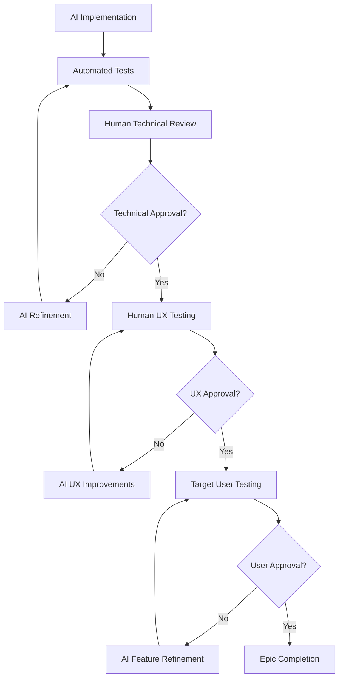

# 🧪 Human Testing Integration Process

## 🎯 Overview

The Proxy Agent Platform implements a **Human-in-the-Loop** development process where AI handles implementation while humans provide critical validation, user experience testing, and real-world feedback.

## 🔄 Human-AI Collaboration Model



## 👥 Testing Roles & Responsibilities

### **1. Technical Reviewer**
**Role**: Senior developer or tech lead
**Responsibilities**:
- Code quality and architecture review
- Security vulnerability assessment
- Performance validation
- Technical standard compliance

**Review Process**:
- Review AI-generated code for quality and maintainability
- Validate architectural decisions against system requirements
- Check security implications and potential vulnerabilities
- Approve or request refinements with specific feedback

### **2. UX Tester**
**Role**: User experience specialist or product designer
**Responsibilities**:
- User interface validation
- Workflow efficiency testing
- Accessibility compliance
- Mobile integration testing

**Testing Process**:
- Test 2-second task capture requirement
- Validate user workflows for clarity and efficiency
- Ensure mobile integrations work seamlessly
- Verify accessibility standards compliance

### **3. Target Users**
**Role**: ADHD professionals and productivity users
**Responsibilities**:
- Real-world usage scenario testing
- Feature effectiveness validation
- User experience feedback
- Productivity improvement measurement

**Testing Process**:
- Use features in real daily workflows
- Provide feedback on effectiveness and usability
- Suggest improvements based on actual needs
- Validate productivity impact claims

## 🔍 Testing Checkpoints by Epic

### **Epic 1: Core Proxy Agents**
**Human Checkpoints**:
1. **Technical Review**: Agent architecture and PydanticAI integration
2. **UX Testing**: 2-second task capture and agent interactions
3. **User Testing**: Real-world productivity workflow validation

**Success Criteria**:
- Agents respond within 500ms consistently
- Task capture meets 2-second requirement
- Users report improved productivity workflow

### **Epic 2: Gamification System**
**Human Checkpoints**:
1. **Technical Review**: XP calculation and achievement system accuracy
2. **UX Testing**: Motivation effectiveness and engagement metrics
3. **User Testing**: Long-term engagement and motivation validation

**Success Criteria**:
- Gamification increases user engagement by 50%+
- Users maintain streaks for 2+ weeks consistently
- Achievement system provides meaningful motivation

### **Epic 3: Mobile Integration**
**Human Checkpoints**:
1. **Technical Review**: iOS/Android integration security and performance
2. **UX Testing**: Mobile workflow efficiency and reliability
3. **User Testing**: Real-world mobile usage scenarios

**Success Criteria**:
- Mobile task capture works reliably across devices
- Integration with Shortcuts/tiles functions properly
- Users prefer mobile capture over desktop

## 📋 Human Testing Commands

### **Enhanced Workflow Commands**
```bash
# Execute with human checkpoints
/execute-prp-with-review <prp-file>

# Deploy for human testing
/deploy-testing <epic-name>

# Collect and process human feedback
/process-feedback <testing-session>

# Human-AI collaborative refinement
/refine-with-feedback <feature> <feedback-file>
```

### **Testing Environment Setup**
```bash
# Set up testing environment
npm run setup:testing

# Deploy latest features for testing
npm run deploy:testing

# Generate testing reports
npm run test:generate-reports

# Collect user feedback
npm run feedback:collect
```

## 📊 Feedback Collection & Integration

### **Feedback Collection Methods**
1. **GitHub Issues**: Technical bugs and enhancement requests
2. **User Testing Sessions**: Structured feedback collection
3. **Analytics Dashboard**: Usage metrics and performance data
4. **User Interviews**: Qualitative insights and feature requests

### **Feedback Processing Workflow**
1. **Collection**: Gather feedback through multiple channels
2. **Categorization**: Technical, UX, feature requests, bugs
3. **Prioritization**: Impact vs effort analysis
4. **AI Implementation**: Let AI implement feasible improvements
5. **Human Validation**: Review AI implementations against feedback

### **Feedback Integration Timeline**
- **Immediate**: Critical bugs and security issues
- **Weekly**: UX improvements and minor feature requests
- **Epic-level**: Major feature additions and architectural changes
- **Quarterly**: Strategic direction and technology decisions

## 🎯 Success Metrics

### **Human Testing Effectiveness**
- **Bug Detection Rate**: Issues caught before production
- **User Satisfaction**: Feedback scores and retention rates
- **Feature Adoption**: Percentage of users using new features
- **Productivity Impact**: Measurable productivity improvements

### **Process Efficiency**
- **Review Turnaround**: Time from AI implementation to human approval
- **Feedback Integration**: Time from feedback to implementation
- **Quality Improvement**: Reduction in post-release issues
- **Development Velocity**: Features delivered per sprint with quality

## 🚀 Getting Started with Human Testing

### **For Technical Reviewers**
1. Review AI-generated code in feature branches
2. Use `/execute-prp-with-review` command for guided review
3. Provide specific, actionable feedback
4. Approve or request refinements with clear criteria

### **For UX Testers**
1. Test features in realistic user scenarios
2. Focus on 2-second task capture requirement
3. Validate mobile integration functionality
4. Document user experience issues and suggestions

### **For Target Users**
1. Use features in real daily productivity workflows
2. Provide honest feedback about effectiveness
3. Suggest improvements based on actual needs
4. Participate in regular user feedback sessions

---

**Human testing ensures that AI efficiency is balanced with real-world usability and user needs.**